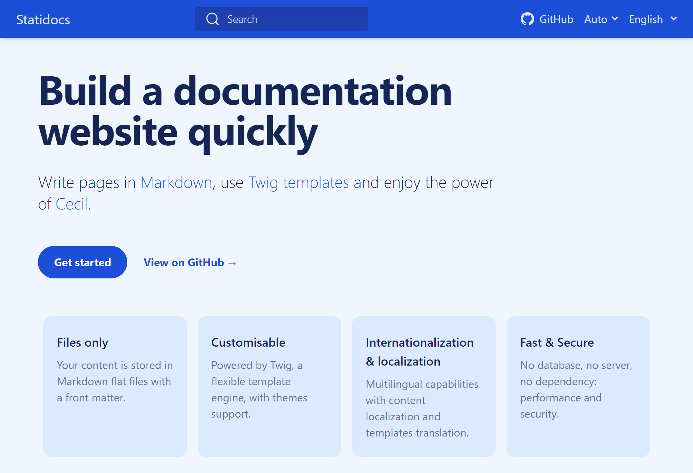

# Statidocs

_Statidocs_ is a starter documentation site built on top of [Cecil](https://cecil.app).

[](https://cecilapp.github.io/statidocs/)

Demo: https://cecilapp.github.io/statidocs/

> [!IMPORTANT]  
> _Statidocs_ is still in development. If something that’s not working, please [open an issue on GitHub](https://github.com/Cecilapp/statidocs/issues/new/choose).

## Install

Use the following [Composer](https://getcomposer.org/) command:

```bash
composer create-project cecil/statidocs my-project
```

[](https://packagist.org/packages/cecil/statidocs)

## Usage

Build & preview:

```bash
php cecil.phar serve
```

Read the [documentation](https://cecilapp.github.io/statidocs/).

## Development

Update themes:

```bash
composer update
```

Build CSS (if necessary):

```bash
npm install
npx tailwindcss -i ./themes/docs/tailwind.css -o ./assets/styles.css
```

## Publish

```bash
php cecil.phar build
```

Then copy content of `_site` to your web server.
