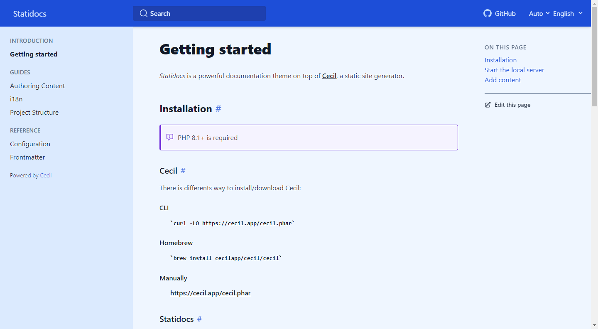

# Statidocs

_Statidocs_ is a starter documentation site built on top of [Cecil](https://cecil.app).

[](https://cecilapp.github.io/statidocs/)

> [!IMPORTANT]  
> _Statidocs_ is still in development. If something that’s not working, please [open an issue on GitHub](https://github.com/Cecilapp/statidocs/issues/new/choose).

## Install

Download _Statidocs_ then Cecil:

```bash
curl -LO https://cecil.app/cecil.phar
```

## Usage

Build & preview:

```bash
php cecil.phar serve
```

### Configuration (`config.yml`)

Disable Service worker / PWA:

```yaml
serviceworker:
  enabled: true
```

## Development

Install/update dependencies:

```bash
composer update
npm install
```

Build CSS (if necessary):

```bash
npx tailwindcss -i ./themes/docs/tailwind.css -o ./assets/styles.css
```

## Publish

```bash
php cecil.phar build
```

Then copy content of `_site` to your web server.
